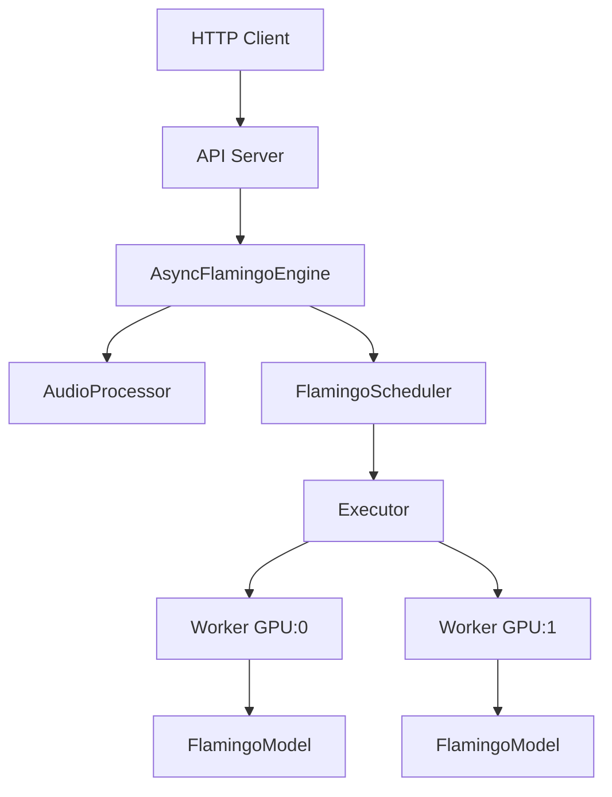

# Architecture Overview

This document describes the multi-layer architecture of the Flamingo Inference Server.

## Request Flow



## Layer Responsibilities

### 1. API Server
**File:** `entrypoints/api_server.py`

The HTTP interface layer. Handles:
- REST endpoints (`/v1/audio/captions`, `/v1/audio/embeddings`, etc.)
- Request validation and error responses
- Fetching audio from URLs or decoding base64
- Health checks for Kubernetes

### 2. AsyncFlamingoEngine
**File:** `engine/async_flamingo.py`

The central coordinator. Bridges async HTTP with sync GPU operations:
- Provides async methods: `generate()`, `embed()`, `analyze()`
- Owns AudioProcessor, Scheduler, and Executor
- Creates `InferenceRequest` objects and submits to scheduler
- Runs audio processing in thread pool to avoid blocking

### 3. AudioProcessor
**File:** `audio/processor.py`

Normalizes audio into model-compatible format:
- Loads from files, bytes, base64, tensors
- Resamples to 48kHz
- Converts stereo to mono
- Validates duration limits

### 4. FlamingoScheduler
**File:** `scheduler/scheduler.py`

Manages request queuing and batching:
- Priority-based request queue
- Audio-aware batching (respects max batch duration)
- Tracks request lifecycle: `WAITING → RUNNING → FINISHED`
- Bridges async futures with background thread execution

### 5. Executor
**Files:** `executor/uniproc_executor.py`, `executor/multiproc_executor.py`

Manages GPU workers:
- **UniprocessExecutor**: Single GPU, same process
- **MultiprocessExecutor**: Multiple GPUs, separate processes

### 6. FlamingoWorker
**File:** `executor/worker.py`

Executes inference on a single GPU:
- Loads model onto assigned GPU
- Routes requests by type (generate/embed/analyze)
- Tracks statistics and memory usage

### 7. FlamingoModel
**File:** `models/flamingo_model.py`

Wrapper around HuggingFace model:
- Text generation via `model.generate()`
- Embedding extraction via audio encoder
- Handles dtype conversion and chat templates

## Why Async?

GPU inference takes seconds. Without async, the server blocks during inference:

```
Sync:  Request1 [===GPU===] Request2 [===GPU===] Request3 [===GPU===]
Async: Request1,2,3 submitted → [===BATCHED GPU===] → All results returned
```

The async design allows:
- Accepting many concurrent connections
- Batching requests for efficient GPU utilization
- Non-blocking request handling

## Deployment Modes

| Mode | Config | Use Case |
|------|--------|----------|
| Single-GPU | `configs/default.yaml` | Development |
| Multi-GPU | `configs/production.yaml` | Production with data parallelism |
